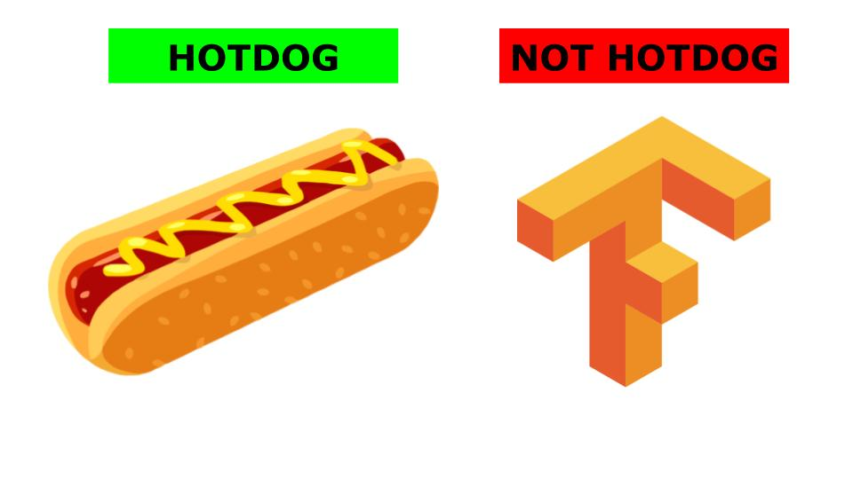

# Not Hotdog ... In Production with TensorFlow and TensorFlow Extended (TFX)

Explore machine learning deployment with [TensorFlow] and the ['not hotdog'] use case from HBO's Silicon Valley].

['not hotdog']: https://www.youtube.com/watch?v=ACmydtFDTGs
[TensorFlow]: https://www.tensorflow.org/



## [View notebook](https://github.com/jkthompson/nothotdog/blob/master/notHotdog.ipynb)

## Run Locally Using Docker
1. Install [Docker](https://hub.docker.com/search/?offering=community&type=edition)
2. Log into [dockerHub](https://hub.docker.com/)
  	```bash
	docker login --username=<docker hub username>
	```
2. Clone this git repo
	```bash
	git clone git@github.com:jkthompson/nothotdog.git
	cd nothotdog
	``` 
3. build the docker image using the tag 'tfx'
  	```bash
	docker build -t tfx .
	```
	alternatively, download the image from Docker hub
	```bash
	# optional - if build dosn't work
	docker pull jkt2/tfx
	```
4. run the image
  	```bash
	docker run -it -p 8888:8888 -v "$PWD":/tf tfx
	```
	
	or image was downloaded from docker hub

	```bash
	docker run -it -p 8888:8888 -v "$PWD":/tf jkt2/tfx
	```
